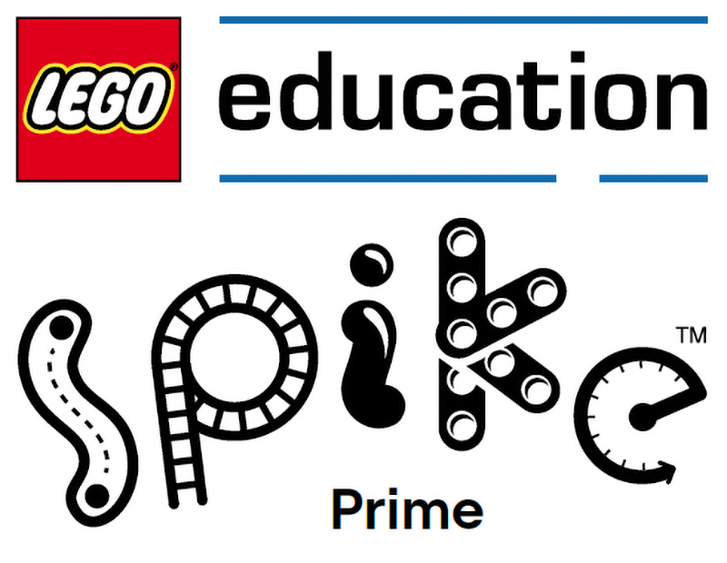

<!-- height or width of logo may be adjusted -->
<!-- This section is where you will replace the link to your transparent logo, the title of your project, and the very short desciptor of your project -->
<!-- If you used Canva to make your icon and don't want to pay for a background remover, you can use the website https://www.remove.bg/ to do so -->

  
  <h1 align="center">Using Lego Spike Prime Sets to Teach Essential Coding Concepts</h1>
  
by team LegoLogic 

<!-- the emojis are not set in stone! If you'd like you can remove them entirely or select your own from https://gist.github.com/rxaviers/7360908 you are welcome to -->

## :loudspeaker: About

This project utilizes LEGO SPIKE sets to create an interactive, educational experience aimed at teaching basic coding concepts through a hands-on workshop. Participants build and program a catapult on wheels to hit color-coded targets, simulating a carnival game. This engaging approach helps learners understand fundamental coding concepts such as variables, conditionals, and loops. The primary target audience for this workshop is students with little to no programming knowledge or experience, providing them with an introduction to coding and robotics in a fun, interactive way.
Check out a demo of our project in action here: (To be added later)

## :bulb: Project Information

### 🔰 Difficulty Level
- **Beginner**

### 🎯 Target Audience
- **6th Grade - College**

### ⏳ Duration of Workshop
- **60-90 minutes**

### 📋 Needed Materials
- Computers with keyboards  
- Access to [spike.legoeducation.com](https://spike.legoeducation.com)  
- At least one LEGO Spike Prime set  

### 🎓 Learning Outcomes
The primary goal of this project is to teach students the essential concepts of **variables, conditionals,** and **loops** in computer coding, primarily using **LEGO Spike robotics** and **block coding**.

### 🔧 Technologies

- #### LEGO SPIKE Prime
**LEGO SPIKE Prime** sets are educational robotics kits that help teach students coding and engineering concepts. They combine programmable motors, sensors, and LEGO building elements to create interactive projects that develop problem-solving and computational thinking skills.  
[Learn more](https://education.lego.com/en-us/products/lego-education-spike-prime)

- #### LEGO SPIKE Software
The **LEGO SPIKE software** is a coding platform designed specifically for the SPIKE Prime sets. It uses a block-based coding interface that is intuitive for beginners, allowing them to program their robots. The software integrates with the SPIKE Prime hardware to enable hands-on learning of coding concepts like **loops, conditionals,** and **variables**.  
[Learn more](https://spike.legoeducation.com)

### 🌐 TAP
This project is part of the TAP (Technology Ambassadors Program) initiative, which aims to promote technology education and awareness. For more information on the TAP program, visit the [GGC TAP website](https://www.ggc.edu/academics/school-of-science-and-technology/research-internships-service-learning/technology-ambassador-program).

Commercial-style 30 second video: To be filled later

<!-- videos can also be dragged and dropped into markdown files if you want them embedded -->

## :pencil2: Team: LegoLogic

<!-- Use the team photo of your choice once youve uploaded it to the team photo folder within the media folder -->

> (From left to right: Miguel, Jenna, Juan.)

<!-- replace with full names of your team members -->

- Juan Guevara
- Miguel Leon
- Jenna Vincent

## :mortar_board: Advisors

<!-- name of the two professors overseeing your TAP class -->

- Dr. Cengiz Gunay
- Dr. Cindy Robertson

## 📄 Project Description

### 🚀 Overview

The workshop revolves around building and programming a **catapult on wheels** that can hit **color-coded targets**, simulating a carnival game. This hands-on project helps participants grasp the basics of programming through a fun and engaging activity.

### 🧩 Sections of the Workshop

1. Introduction to LEGO SPIKE Prime and Coding Basics
   The session starts with an introduction to LEGO SPIKE Prime robotics, covering components like motors, sensors, and basic elements. Participants are introduced to the SPIKE software and its block-based     
   coding interface to set a foundation for the activities.

2. Programming the Catapult (Pre-Built)
   Participants jump into coding by using the central hub as a controller, learning variables and loops through hands-on practice. They then test their code with the catapult.

3. Programming the Button (Conditional Logic)
   In the next stage, participants code a button to trigger the catapult, introducing conditionals. After programming, they test the code to experience how the button functions.

4. Adding a Color Sensor (Conditional with If Statements)
   In the final coding segment, participants replace the button with a color sensor. They program the catapult to launch at different angles based on the sensor’s detected color, providing another example of   
   conditionals and if statements.

5. Interactive Target Practice and Reflection
   After testing, participants bring their catapults to the front to hit targets and play for a few minutes. The session concludes with a reflection, where participants share insights, discuss challenges, and   
   reinforce their learning on variables, loops, and conditionals.

## :memo: Publications

<!-- team members, then professors/advisors. "Name of Publication", event, month and day, year, Georgia Gwinnett College. -->

To be filled Later

## :open_hands: Outreach

1. <b>TAP Expo</b>, October 8, 2024, Georgia Gwinnett College: to promote the IT field and encourage college students to sign up for TAP.
2. <b>Class Workshops</b>, October 21-24, 2024, Georgia Gwinnett College: to promote the IT field to non-IT students.

## :computer: Technology

<!-- be sure to use the alt text feature in case anybody viewing your repo is using  screen reader! you want your workshop to be as accessible as possible -->

  

- [LEGO SPIKE]([https://scratch.mit.edu/](https://education.lego.com/en-us/products/lego-education-spike-essential-set/45345/?ef_id=ZNfR2gAIF3e9GwAb%3A20240903192900%3As&mtm_campaign=BI-US-EN-BR-PS-BUY-EDUCATION-SPIKE_PRIME_ESSENTIAL-SHOP-BP-PH-RN-XX&mtm_cid=MTM-M3M7-C8M7P7&mtm_content=General&mtm_kwd=lego+spike&mtm_medium=paid-search&mtm_source=bing&s_kwcid=AL%21790%2110%21%2181158025851687#spike%E2%84%A2-essential)) Prime sets are educational robotics kits designed to teach students coding and engineering concepts through hands-on, interactive projects. They combine programmable motors and sensors with LEGO building elements to help learners develop problem-solving and computational thinking skills in a fun and engaging way.

## Project Setup

<i> This section is dedicated to linking to .md files in your documents/tutorial/ folder that will contain instructions on installation

Your repo doesn't have to have every section used below. This is just an example so you can get an idea of what your own repo should look like</i>

### Opening a blank project with Lego Spike Education

[Click here to view instructions](/documents/tutorial%20materials/Setting%20up%20a%20new%20project%20in%20Lego%20Spike%20Education.docx)

[Video with Scratch instructions](https://youtu.be/v-GUbj7DMEE)

## Usage

<i> Describe HOW to use your game. </i>

## Short Demo Instructions

[Demo Video on how to install and play our game](https://youtu.be/mA80Aa55t-U)

## Workshop Instructions

[Click here to view workshop walkthrough pdf file](/Documents/tutorial/Scratch%20Workshop%20Walkthrough.pdf)

[Our Game Workshop Video](https://youtu.be/Mtsre0iMStM)
